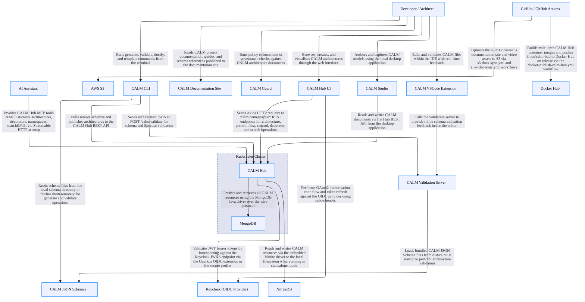

# CALM Architecture Discovery By Claude Code (Sonnet 4.6)

## Architecture Metadata

- **discovered-by:** Claude (claude-sonnet-4-6)
- **discovery-date:** 2026-05-02
- **source-repository:** https://github.com/finos/architecture-as-code
- **status:** draft
- **note:** Initial discovery via static analysis — review and validate before use in production

## System Architecture

## Architecture Statistics

- **Total Nodes:** 18
- **Total Relationships:** 22

## Components by Type

### Developer / Architect

**Type:** `actor`  
**Unique ID:** `developer`

#### Description
Human user who creates, validates, and explores CALM architecture models via the Hub UI, CLI, desktop studio, or IDE extension

---

### AI Assistant

**Type:** `actor`  
**Unique ID:** `ai-assistant`

#### Description
AI agents (Claude, GitHub Copilot, Codex, Kiro) that interact with the CALM Hub via the MCP endpoint to assist with architecture authoring and discovery

---

### CALM Hub UI

**Type:** `webclient`  
**Unique ID:** `calm-hub-ui`

#### Description
React 19 single-page application providing a browser-based interface to browse, create, and visualise CALM architectures, patterns, flows, controls, and decorators. Vite dev server proxies API calls to the CALM Hub backend on port 8080

#### Interfaces

This component exposes the following interfaces:

- **** (`calm-hub-ui-url`)
  - **Protocol:** 
  - **Description:** 

---

### CALM Documentation Site

**Type:** `webclient`  
**Unique ID:** `calm-docs`

#### Description
Docusaurus v3 static documentation website for the FINOS CALM project. Built by CI/CD and published to AWS S3 for public access

---

### CALM Studio

**Type:** `webclient`  
**Unique ID:** `calm-studio`

#### Description
Electron-based cross-platform desktop application for creating and exploring CALM architecture models locally without a running Hub instance

---

### CALM Hub

**Type:** `service`  
**Unique ID:** `calm-hub`

#### Description
Java/Quarkus REST API backend providing full CRUD for CALM namespaces, architectures, patterns, flows, controls, decorators, standards, and ADRs. Also exposes an MCP (Model Context Protocol) endpoint at /mcp for AI assistant integrations. Supports pluggable persistence via MongoDB (production) or embedded NitriteDB (standalone)

#### Interfaces

This component exposes the following interfaces:

- **** (`calm-hub-rest-api`)
  - **Protocol:**  / **Port:** 8080
  - **Description:** 
- **** (`calm-hub-mcp-endpoint`)
  - **Protocol:** 
  - **Description:** 

---

### CALM Validation Server

**Type:** `service`  
**Unique ID:** `calm-server`

#### Description
Node.js/Express standalone validation server exposing POST /calm/validate. Validates CALM architecture JSON against bundled schemas and Spectral rules. Runs on port 3000 by default, bound to 127.0.0.1

#### Interfaces

This component exposes the following interfaces:

- **** (`calm-server-api`)
  - **Protocol:**  / **Port:** 3000
  - **Description:** 

---

### CALM CLI

**Type:** `service`  
**Unique ID:** `calm-cli`

#### Description
Node.js command-line tool (calm) for generating architectures from patterns, validating models, running Handlebars templates, generating documentation sites, and initialising AI assistant configurations via calm init-ai

---

### CALM VSCode Extension

**Type:** `service`  
**Unique ID:** `vscode-extension`

#### Description
Visual Studio Code extension providing CALM-aware JSON editing, inline validation feedback, and AI-assisted architecture authoring within the IDE

---

### CALM Guard

**Type:** `service`  
**Unique ID:** `calm-guard`

#### Description
Standalone service responsible for CALM policy enforcement or governance checks. Exact responsibilities inferred from a dedicated CI workflow (build-calm-guard.yml); requires further investigation

---

### CALM JSON Schemas

**Type:** `data-asset`  
**Unique ID:** `calm-schemas`

#### Description
Versioned JSON Schema files (calm.json, core.json, interface.json, flow.json, control.json, timeline.json, etc.) stored under /calm/release/ and /calm/draft/. Consumed by all validators, the CLI, and the Hub for schema resolution and validation

---

### MongoDB

**Type:** `database`  
**Unique ID:** `mongodb`

#### Description
MongoDB database (port 27017, database calmSchemas) used as the primary persistent store for all CALM Hub resources in production and containerised deployments

#### Interfaces

This component exposes the following interfaces:

- **** (`mongodb-connection`)
  - **Protocol:**  / **Port:** 27017
  - **Description:** 

---

### NitriteDB

**Type:** `database`  
**Unique ID:** `nitritedb`

#### Description
Embedded NoSQL database persisted to ~/.calm-hub/data, used as the CALM Hub store in standalone or development mode. No external service required; selected at runtime via calm.database.mode configuration

---

### Keycloak (OIDC Provider)

**Type:** `ecosystem`  
**Unique ID:** `keycloak`

#### Description
External identity provider offering OAuth2/OIDC authentication for the CALM Hub backend and UI when running in the secure deployment profile. Dev instance runs on port 9443

#### Interfaces

This component exposes the following interfaces:

- **** (`keycloak-oidc-endpoint`)
  - **Protocol:**  / **Port:** 9443
  - **Description:** 

---

### Docker Hub

**Type:** `ecosystem`  
**Unique ID:** `docker-hub`

#### Description
Public container image registry. CALM Hub multi-arch images (finos/calm-hub:latest) are built for amd64 and arm64 and pushed here by the docker-publish-calm-hub.yml CI workflow on release

---

### AWS S3

**Type:** `ecosystem`  
**Unique ID:** `aws-s3`

#### Description
Cloud object storage used to host the published CALM documentation site and video assets. Synced by GitHub Actions workflows s3-docs-sync.yml and s3-video-sync.yml

---

### GitHub / GitHub Actions

**Type:** `ecosystem`  
**Unique ID:** `github`

#### Description
Source control and CI/CD platform. GitHub Actions orchestrates all build, test, security scanning (CVE, licence, Semgrep), Docker publishing, and release workflows for every package in the monorepo

---

### Kubernetes Cluster

**Type:** `network`  
**Unique ID:** `k8s-cluster`

#### Description
Container orchestration cluster hosting the calmhub Deployment (exposed via LoadBalancer on port 80→8080) and the mongodb Deployment (exposed internally via ClusterIP on port 27017). Raw manifests provided under calm-hub/k8s/

---

