# CALM Architecture Discovery By Codex (GPT 5.5 Hig)

## Architecture Metadata

- **discovery-method:** static-analysis
- **created-by:** codex-5.5-high
- **scope:** minimal discovered architecture
- **source-workspace:** /Users/jim/Desktop/finos/calm-architecture-discovery-skill

## System Architecture

```mermaid
---
config:
  theme: base
  themeVariables:
    fontFamily: -apple-system, BlinkMacSystemFont, 'Segoe WPC', 'Segoe UI', system-ui, 'Ubuntu', sans-serif
    darkMode: false
    fontSize: 14px
    edgeLabelBackground: '#d5d7e1'
    lineColor: '#000000'
---
%%{init: {"layout": "elk", "flowchart": {"htmlLabels": false}}}%%
flowchart TB
classDef boundary fill:#e1e4f0,stroke:#204485,stroke-dasharray: 5 4,stroke-width:1px,color:#000000;
classDef node fill:#eef1ff,stroke:#007dff,stroke-width:1px,color:#000000;
classDef iface fill:#f0f0f0,stroke:#b6b6b6,stroke-width:1px,font-size:10px,color:#000000;
classDef highlight fill:#fdf7ec,stroke:#f0c060,stroke-width:1px,color:#000000;

        subgraph deployment-platform["Docker and Kubernetes Runtime"]
        direction TB
            mongodb["MongoDB"]:::node
                subgraph architecture-as-code-repo["Architecture as Code Monorepo"]
                direction TB
                    advent-site["Advent of CALM Site"]:::node
                    calm-ai["CALM AI Prompts and Tooling"]:::node
                    calm-cli["CALM CLI"]:::node
                    docs-site["CALM Documentation Site"]:::node
                    calm-hub-mcp["CALM Hub MCP Endpoint"]:::node
                    calm-hub-ui["CALM Hub UI"]:::node
                    calm-models["CALM Models Package"]:::node
                    calm-specification["CALM Schemas and Examples"]:::node
                    calm-server["CALM Server"]:::node
                    calm-shared["CALM Shared Library"]:::node
                    calm-vscode-plugin["CALM VS Code Extension"]:::node
                    calm-widgets["CALM Widgets"]:::node
                    calm-studio["CalmStudio"]:::node
                    calmstudio-mcp["CalmStudio MCP Server"]:::node
                        subgraph calm-guard["CALMGuard"]
                        direction TB
                            calmguard-agents["CALMGuard Agent Squad"]:::node
                        end
                        class calm-guard boundary
                end
                class architecture-as-code-repo boundary
        end
        class deployment-platform boundary

    aws-static-hosting["AWS S3 and CloudFront"]:::node
    developer["Developer or Architect"]:::node
    docker-hub["Docker Hub"]:::node
    github["GitHub"]:::node
    keycloak["Keycloak"]:::node
    llm-providers["LLM Providers"]:::node
    local-calm-documents["Local CALM Documents"]:::node
    nitritedb["NitriteDB"]:::node

    developer -->|Runs local CALM commands for generation, validation, templating, documentation, and AI setup.| calm-cli
    developer -->|Browses and manages Hub resources through the web UI.| calm-hub-ui
    developer -->|Previews, navigates, validates, and documents CALM models inside VS Code.| calm-vscode-plugin
    calm-cli -->|Loads local architectures, patterns, timelines, templates, and mappings from the workspace.| local-calm-documents
    calm-cli -->|Retrieves Hub documents when configured with a CALM Hub URL.| calm-hub
    calm-cli -->|Loads allowlisted remote schema and document URLs, including calm.finos.org resources.| calm-specification
    calm-cli -->|Delegates validation, generation, loaders, and templating to shared code.| calm-shared
    calm-shared -->|Uses CALM model and type definitions.| calm-models
    calm-shared -->|Uses widgets for docify and template generation.| calm-widgets
    calm-server -->|Validates CALM documents through shared validation logic.| calm-shared
    developer -->|Posts CALM architecture JSON to the standalone validation endpoint.| calm-server
    calm-hub-ui -->|Calls Hub REST APIs under the /calm path.| calm-hub
    calm-hub-ui -->|Uses OIDC authorization code flow in secure mode.| keycloak
    calm-hub -->|Validates JWTs from Keycloak in the secure profile.| keycloak
    calm-hub -->|Uses MongoDB as the default persistent store.| mongodb
    calm-hub -->|Uses embedded NitriteDB for standalone storage mode.| nitritedb
    developer -->|MCP-capable clients call Hub tools at the MCP endpoint.| calm-hub-mcp
    calm-vscode-plugin -->|Uses shared and internal tooling for docify, validation, and rendering helpers.| calm-shared
    calm-cli -->|Copies assistant configurations and prompt files for supported providers.| calm-ai
    github -->|GitHub workflow builds Docusaurus and syncs static assets to S3, then invalidates CloudFront.| aws-static-hosting
    github -->|GitHub workflow builds and pushes the CALM Hub container image.| docker-hub
    calm-guard -->|Fetches CALM files and creates remediation pull requests through GitHub APIs.| github
    developer -->|Streams live agent events to the dashboard using server-sent events.| calm-guard
    calmguard-agents -->|Uses configured provider APIs for structured compliance analysis.| llm-providers
    developer -->|AI clients can drive CalmStudio architecture operations through MCP transports.| calmstudio-mcp
    calm-studio -->|Imports and exports CALM JSON, SVG, PNG, and related artifacts.| local-calm-documents



```

## Architecture Statistics

- **Total Nodes:** 28
- **Total Relationships:** 34

## Components by Type

### Architecture as Code Monorepo

**Type:** `system`  
**Unique ID:** `architecture-as-code-repo`

#### Description
FINOS CALM specification and tool monorepo.

---

### Developer or Architect

**Type:** `actor`  
**Unique ID:** `developer`

#### Description
Human user creating, validating, visualizing, and publishing CALM assets.

---

### CALM Schemas and Examples

**Type:** `data-asset`  
**Unique ID:** `calm-specification`

#### Description
JSON schemas, patterns, controls, interfaces, sample architectures, and release or draft metadata under calm.

---

### CALM CLI

**Type:** `service`  
**Unique ID:** `calm-cli`

#### Description
Node CLI for generate, validate, template, docify, and AI assistant initialization.

---

### CALM Shared Library

**Type:** `service`  
**Unique ID:** `calm-shared`

#### Description
Shared validation, document loading, Spectral rules, template, docify, and resolver logic.

---

### CALM Models Package

**Type:** `data-asset`  
**Unique ID:** `calm-models`

#### Description
Type definitions and model classes for CALM documents.

---

### CALM Widgets

**Type:** `service`  
**Unique ID:** `calm-widgets`

#### Description
Handlebars widget package for generated CALM documentation.

---

### CALM Server

**Type:** `service`  
**Unique ID:** `calm-server`

#### Description
Standalone Express HTTP validation server exposing health and CALM validation endpoints.

---

### CALM Hub API

**Type:** `service`  
**Unique ID:** `calm-hub`

#### Description
Quarkus REST API for namespaces, architectures, patterns, flows, controls, decorators, schemas, search, ADRs, and user access.

---

### CALM Hub MCP Endpoint

**Type:** `service`  
**Unique ID:** `calm-hub-mcp`

#### Description
Embedded Quarkiverse MCP server exposed by CALM Hub.

---

### CALM Hub UI

**Type:** `webclient`  
**Unique ID:** `calm-hub-ui`

#### Description
React and Vite UI for browsing, visualizing, searching, and managing CALM Hub content.

---

### MongoDB

**Type:** `database`  
**Unique ID:** `mongodb`

#### Description
Default persistent store for CALM Hub using the calmSchemas database.

---

### NitriteDB

**Type:** `database`  
**Unique ID:** `nitritedb`

#### Description
Embedded standalone CALM Hub storage mode.

---

### Keycloak

**Type:** `ecosystem`  
**Unique ID:** `keycloak`

#### Description
Local secure-profile OIDC provider for CALM Hub and Hub UI authentication.

---

### CALM VS Code Extension

**Type:** `service`  
**Unique ID:** `calm-vscode-plugin`

#### Description
VS Code extension for preview, navigation, validation, tree view, and documentation generation workflows.

---

### CALM Documentation Site

**Type:** `webclient`  
**Unique ID:** `docs-site`

#### Description
Docusaurus documentation site published to calm.finos.org.

---

### Advent of CALM Site

**Type:** `webclient`  
**Unique ID:** `advent-site`

#### Description
Astro educational content site.

---

### CALM AI Prompts and Tooling

**Type:** `data-asset`  
**Unique ID:** `calm-ai`

#### Description
Provider-specific prompt and configuration assets installed by calm init-ai.

---

### CALMGuard

**Type:** `system`  
**Unique ID:** `calm-guard`

#### Description
Next.js continuous compliance platform with dashboard, API routes, and AI agent orchestration.

---

### CALMGuard Agent Squad

**Type:** `service`  
**Unique ID:** `calmguard-agents`

#### Description
LLM-backed and deterministic agents for analysis, compliance mapping, risk scoring, pipelines, and remediation.

---

### CalmStudio

**Type:** `webclient`  
**Unique ID:** `calm-studio`

#### Description
SvelteKit visual CALM editor with canvas, code sync, import/export, and validation.

---

### CalmStudio MCP Server

**Type:** `service`  
**Unique ID:** `calmstudio-mcp`

#### Description
MCP server with stdio and HTTP transports for AI-driven architecture creation and editing.

---

### GitHub

**Type:** `ecosystem`  
**Unique ID:** `github`

#### Description
Source hosting, Actions CI, repository APIs, PR creation, and issue links.

---

### LLM Providers

**Type:** `ecosystem`  
**Unique ID:** `llm-providers`

#### Description
Google Gemini, Anthropic Claude, OpenAI, and xAI providers used by CALMGuard.

---

### AWS S3 and CloudFront

**Type:** `ecosystem`  
**Unique ID:** `aws-static-hosting`

#### Description
Static hosting and cache invalidation target for documentation workflows.

---

### Docker Hub

**Type:** `ecosystem`  
**Unique ID:** `docker-hub`

#### Description
Target registry for published CALM Hub container images.

---

### Docker and Kubernetes Runtime

**Type:** `ecosystem`  
**Unique ID:** `deployment-platform`

#### Description
Container and Kubernetes deployment boundary found in Docker Compose and Kubernetes manifests.

---

### Local CALM Documents

**Type:** `data-asset`  
**Unique ID:** `local-calm-documents`

#### Description
Architecture, pattern, template, timeline, ADR, and control files consumed by CALM tools.

---

