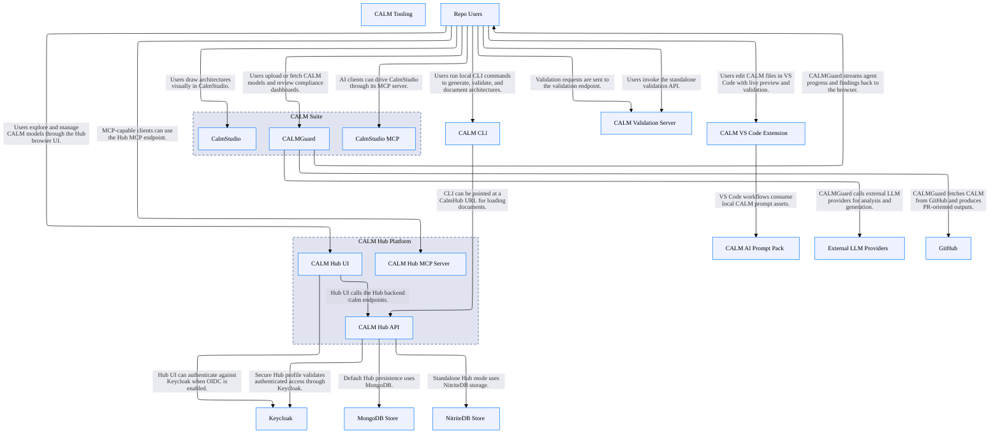

# CALM Architecture Discovery By Codex (GPT 5.4 Medium)

## System Architecture

## Architecture Statistics

- **Total Nodes:** 19
- **Total Relationships:** 25

## Components by Type

### Repo Users

**Type:** `actor`  
**Unique ID:** `repo-users`

#### Description
Developers, architects, and operators using the monorepo tools and user interfaces.

---

### CALM Hub Platform

**Type:** `system`  
**Unique ID:** `calm-hub-platform`

#### Description
Hub-related subsystem combining web UI, backend API, MCP endpoint, storage, and optional authentication.

---

### CALM Hub UI

**Type:** `webclient`  
**Unique ID:** `calm-hub-ui`

#### Description
React and Vite browser UI for browsing and visualizing CALM resources.

---

### CALM Hub API

**Type:** `service`  
**Unique ID:** `calm-hub-api`

#### Description
Quarkus backend serving /calm APIs and Swagger UI.

---

### CALM Hub MCP Server

**Type:** `service`  
**Unique ID:** `calm-hub-mcp`

#### Description
Embedded MCP endpoint exposed by CALM Hub at /mcp.

---

### MongoDB Store

**Type:** `database`  
**Unique ID:** `calm-hub-mongo`

#### Description
Default persistence for CALM Hub in non-standalone mode.

---

### NitriteDB Store

**Type:** `database`  
**Unique ID:** `calm-hub-nitrite`

#### Description
Embedded standalone persistence option for CALM Hub.

---

### Keycloak

**Type:** `ecosystem`  
**Unique ID:** `keycloak-idp`

#### Description
Optional OIDC identity provider for the secure CALM Hub profile.

---

### CALM Tooling

**Type:** `system`  
**Unique ID:** `calm-tooling`

#### Description
Local and IDE-oriented toolchain around CALM authoring and validation.

---

### CALM CLI

**Type:** `service`  
**Unique ID:** `calm-cli`

#### Description
Node-based CLI for generate, validate, template, docify, and AI bootstrap commands.

---

### CALM Validation Server

**Type:** `service`  
**Unique ID:** `calm-server`

#### Description
Standalone HTTP validation service exposing /health and /calm/validate.

---

### CALM VS Code Extension

**Type:** `service`  
**Unique ID:** `calm-vscode`

#### Description
IDE extension for live preview, validation, navigation, and documentation workflows.

---

### CALM AI Prompt Pack

**Type:** `data-asset`  
**Unique ID:** `calm-ai-prompts`

#### Description
Prompt templates and assistant configs consumed by calm init-ai and AI-assisted workflows.

---

### CALM Suite

**Type:** `system`  
**Unique ID:** `calm-suite`

#### Description
Product area containing CalmStudio and CALMGuard.

---

### CalmStudio

**Type:** `webclient`  
**Unique ID:** `calmstudio-ui`

#### Description
Svelte-based visual editor that produces CALM JSON.

---

### CalmStudio MCP

**Type:** `service`  
**Unique ID:** `calmstudio-mcp`

#### Description
MCP server for architecture CRUD, validation, render, and import or export.

---

### CALMGuard

**Type:** `service`  
**Unique ID:** `calmguard-app`

#### Description
Next.js compliance analysis app with SSE streaming and multi-agent orchestration.

---

### External LLM Providers

**Type:** `ecosystem`  
**Unique ID:** `llm-providers`

#### Description
Gemini, Claude, GPT, and Grok providers used by CALMGuard.

---

### GitHub

**Type:** `ecosystem`  
**Unique ID:** `github-ecosystem`

#### Description
Remote repository and pull request platform referenced by CALMGuard and CI workflows.

---

