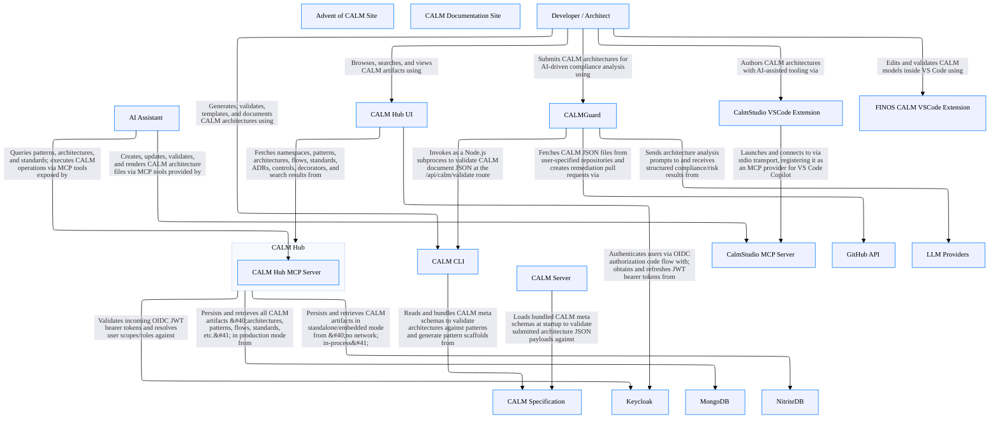

# CALM Architecture Discovery By Github Copilot (Claude Sonnet 4.6)

## System Architecture

## Architecture Statistics

- **Total Nodes:** 19
- **Total Relationships:** 19

## Components by Type

### Developer / Architect

**Type:** `actor`  
**Unique ID:** `developer`

#### Description
A software developer or architect who authors, validates, and manages CALM architecture models using the CLI, IDE extensions, or web UIs

---

### AI Assistant

**Type:** `actor`  
**Unique ID:** `ai-assistant`

#### Description
An AI coding assistant (GitHub Copilot, Claude Code, etc.) that interacts with CALM via MCP tool servers to author and query architectures

---

### CALM Hub UI

**Type:** `webclient`  
**Unique ID:** `calm-hub-ui`

#### Description
React 19 SPA (Vite build) for browsing, searching, and visualizing CALM artifacts stored in CALM Hub; uses OIDC for optional authentication

---

### CALMGuard

**Type:** `webclient`  
**Unique ID:** `calm-guard`

#### Description
Next.js 15 full-stack web application that runs a 4-agent AI pipeline to analyze CALM architectures for compliance and risk

---

### CALM Documentation Site

**Type:** `webclient`  
**Unique ID:** `docs-site`

#### Description
Docusaurus-based public documentation website served at calm.finos.org

---

### Advent of CALM Site

**Type:** `webclient`  
**Unique ID:** `advent-of-calm-site`

#### Description
Astro-based educational website hosting the 24-day CALM architecture challenge

---

### CALM Hub

**Type:** `service`  
**Unique ID:** `calm-hub`

#### Description
Java/Quarkus REST API backend — central registry for CALM architectures, patterns, flows, standards, interfaces, controls, ADRs, and decorators, namespaced across domains

---

### CALM Hub MCP Server

**Type:** `service`  
**Unique ID:** `calm-hub-mcp-server`

#### Description
Model Context Protocol server embedded inside CALM Hub, exposing CALM operations as JSON-RPC tools to AI assistants via the /mcp HTTP endpoint

---

### CALM Server

**Type:** `service`  
**Unique ID:** `calm-server`

#### Description
TypeScript/Express HTTP server exposing a /calm/validate REST endpoint and /health check; bundles CALM meta schemas for offline validation

---

### CALM CLI

**Type:** `service`  
**Unique ID:** `calm-cli`

#### Description
TypeScript CLI (@finos/calm-cli) providing generate, validate, template, docify, and init-ai commands for CALM model lifecycle management

---

### FINOS CALM VSCode Extension

**Type:** `service`  
**Unique ID:** `vscode-extension-finos`

#### Description
VSCode extension (calm-plugins/vscode) for editing, validating, and visualizing CALM architecture models inside the IDE

---

### CalmStudio MCP Server

**Type:** `service`  
**Unique ID:** `calmstudio-mcp-server`

#### Description
Model Context Protocol server (calm-suite/calm-studio) providing architecture authoring tools to AI assistants via stdio or HTTP transport

---

### CalmStudio VSCode Extension

**Type:** `service`  
**Unique ID:** `calmstudio-vscode-extension`

#### Description
VSCode extension (calm-suite/calm-studio) that registers the CalmStudio MCP server as a VS Code Copilot tool provider

---

### MongoDB

**Type:** `database`  
**Unique ID:** `mongodb`

#### Description
MongoDB document database — production storage backend for CALM Hub; stores all CALM artifacts in namespace-scoped collections

---

### NitriteDB

**Type:** `database`  
**Unique ID:** `nitritedb`

#### Description
Embedded NitriteDB document store — standalone/local-dev storage backend for CALM Hub, requiring no external database process

---

### Keycloak

**Type:** `ecosystem`  
**Unique ID:** `keycloak`

#### Description
OpenID Connect identity provider for CALM Hub authentication; issues JWT bearer tokens and manages the calm-hub-realm with role-based scopes

---

### GitHub API

**Type:** `ecosystem`  
**Unique ID:** `github-api`

#### Description
GitHub REST API used by CALMGuard to fetch CALM architecture files from public/private repositories and to create remediation pull requests

---

### LLM Providers

**Type:** `ecosystem`  
**Unique ID:** `llm-providers`

#### Description
External AI language model APIs (Google Gemini, Anthropic Claude, OpenAI GPT, Grok) consumed by CALMGuard&#x27;s agent pipeline via the Vercel AI SDK

---

### CALM Specification

**Type:** `data-asset`  
**Unique ID:** `calm-specification`

#### Description
Versioned CALM JSON meta schemas (calm/ directory, release/1.2 and earlier) defining the canonical node, relationship, interface, flow, and control schemas

---

