## System Architecture

```mermaid
---
config:
  theme: base
  themeVariables:
    fontFamily: -apple-system, BlinkMacSystemFont, 'Segoe WPC', 'Segoe UI', system-ui, 'Ubuntu', sans-serif
    darkMode: false
    fontSize: 14px
    edgeLabelBackground: '#d5d7e1'
    lineColor: '#000000'
---
%%{init: {"layout": "elk", "flowchart": {"htmlLabels": false}}}%%
flowchart TB
classDef boundary fill:#e1e4f0,stroke:#204485,stroke-dasharray: 5 4,stroke-width:1px,color:#000000;
classDef node fill:#eef1ff,stroke:#007dff,stroke-width:1px,color:#000000;
classDef iface fill:#f0f0f0,stroke:#b6b6b6,stroke-width:1px,font-size:10px,color:#000000;
classDef highlight fill:#fdf7ec,stroke:#f0c060,stroke-width:1px,color:#000000;


    ai-assistant["AI Assistant"]:::node
    aws-s3["AWS S3"]:::node
    calm-cli["CALM CLI"]:::node
    calm-hub["CALM Hub"]:::node
    calm-hub-ui["CALM Hub UI"]:::node
    calm-server["CALM Server"]:::node
    calm-vscode-extension["CALM VSCode Extension"]:::node
    calm-guard["CALMGuard"]:::node
    calm-studio-desktop["CalmStudio Desktop"]:::node
    calm-studio-mcp-server["CalmStudio MCP Server"]:::node
    developer["Developer / Architect"]:::node
    docker-hub["Docker Hub"]:::node
    github-actions["GitHub Actions"]:::node
    github-api["GitHub REST API"]:::node
    keycloak["Keycloak Identity Provider"]:::node
    llm-providers["LLM Providers"]:::node
    mongodb["MongoDB"]:::node

    developer -->|Browses, searches, and visualises CALM resources through the web interface.| calm-hub-ui
    developer -->|Runs generate, validate, docify, template, and init-ai commands from the terminal.| calm-cli
    developer -->|Posts CALM architecture JSON to the standalone validation endpoint.| calm-server
    developer -->|Uploads or fetches CALM models and reviews AI-generated compliance analysis results.| calm-guard
    developer -->|Authors and explores CALM models visually using the desktop application.| calm-studio-desktop
    developer -->|Edits and validates CALM files within VS Code with real-time diagnostics and diagram preview.| calm-vscode-extension
    ai-assistant -->|Invokes CALM Hub MCP tools #40;list/create architectures, decorators, namespaces, search#41; via the embedded MCP server at /mcp.| calm-hub
    ai-assistant -->|Uses CalmStudio MCP tools to create, edit, and validate CALM architecture files.| calm-studio-mcp-server
    calm-hub-ui -->|Sends Axios HTTP requests to /calm/namespaces/* REST endpoints to fetch and display architectures, patterns, flows, controls, decorators, and search results.| calm-hub
    calm-hub-ui -->|Performs the OAuth2 authorisation-code flow and silent token renewal via oidc-client-ts when the secure profile is enabled.| keycloak
    calm-cli -->|Retrieves remote CALM schemas and documents from the CALM Hub REST API when a --calm-hub-url is supplied.| calm-hub
    calm-hub -->|Persists and retrieves all CALM resources using the MongoDB Java driver over the MongoDB wire protocol on port 27017.| mongodb
    calm-hub -->|Validates JWT bearer tokens on /calm/* and /mcp/* routes by introspecting against the Keycloak JWKS endpoint via the Quarkus OIDC extension #40;secure profile only#41;.| keycloak
    calm-guard -->|Spawns the calm-cli Node.js subprocess to validate CALM documents server-side for the /api/calm/validate endpoint.| calm-cli
    calm-guard -->|Calls external LLM provider APIs #40;OpenAI, Anthropic, Google Gemini, xAI#41; via the Vercel AI SDK to run the AI compliance-analysis agent pipeline.| llm-providers
    calm-guard -->|Calls the GitHub REST API to fetch CALM files from repositories and to create pull requests with generated architecture or remediation content.| github-api
    calm-studio-desktop -->|Reads and writes CALM documents via the CALM Hub REST API from the desktop application.| calm-hub
    github-actions -->|Builds and pushes the finos/calm-hub multi-arch Docker image to Docker Hub on release via the docker-publish-calm-hub.yml workflow.| docker-hub
    github-actions -->|Uploads the built Docusaurus documentation site and video assets to S3 via s3-docs-sync.yml and s3-video-sync.yml workflows.| aws-s3



```

## Architecture Statistics

- **Total Nodes:** 17
- **Total Relationships:** 19

## Components by Type

### Developer / Architect

**Type:** `actor`  
**Unique ID:** `developer`

#### Description
Human developer or architect who authors, validates, and explores CALM architecture models using the toolchain.

---

### AI Assistant

**Type:** `actor`  
**Unique ID:** `ai-assistant`

#### Description
AI coding assistant or MCP client (e.g. Claude, Copilot) that drives CALM operations through MCP tooling.

---

### CALM Hub

**Type:** `service`  
**Unique ID:** `calm-hub`

#### Description
Java/Quarkus REST API serving as the central registry for CALM architectures, patterns, flows, standards, interfaces, controls, ADRs, and decorators; includes an embedded MCP server. Exposes HTTP on port 8080 and HTTPS on port 8443 (secure profile).

#### Interfaces

This component exposes the following interfaces:

- **** (`calm-hub-rest-http`)
  - **Protocol:** 
  - **Description:** HTTP REST API for CALM Hub resources including namespaces, architectures, patterns, flows, standards, interfaces, controls, ADRs, and decorators.
- **** (`calm-hub-rest-https`)
  - **Protocol:** 
  - **Description:** HTTPS REST API for CALM Hub (secure profile) with JWT authentication enforced on all /calm/* paths.
- **** (`calm-hub-mcp-endpoint`)
  - **Protocol:** 
  - **Description:** Embedded Model Context Protocol (MCP) server exposing CALM Hub operations as JSON-RPC tools to AI assistants.

---

### CALM Hub UI

**Type:** `webclient`  
**Unique ID:** `calm-hub-ui`

#### Description
React/Vite single-page application for browsing, searching, and visualising CALM resources stored in CALM Hub. Proxies /calm/* to CALM Hub on port 8080; uses oidc-client-ts for OIDC authentication when the secure profile is active.

#### Interfaces

This component exposes the following interfaces:

- **** (`calm-hub-ui-web`)
  - **Protocol:** 
  - **Description:** React SPA served by Vite development server; in production served as static assets bundled within the CALM Hub Quarkus container.

---

### MongoDB

**Type:** `database`  
**Unique ID:** `mongodb`

#### Description
MongoDB document store used by CALM Hub to persist all CALM resources via the Java MongoDB driver. Database name: calmSchemas.

#### Interfaces

This component exposes the following interfaces:

- **** (`mongodb-wire`)
  - **Protocol:** 
  - **Description:** MongoDB wire protocol connection on port 27017; CALM Hub connects using database name &#x27;calmSchemas&#x27;.

---

### CALM Server

**Type:** `service`  
**Unique ID:** `calm-server`

#### Description
Standalone TypeScript/Express HTTP server exposing a CALM document validation endpoint and health check. Binds to 127.0.0.1:3000 by default; bundles CALM meta-schemas; no authentication or authorisation controls.

#### Interfaces

This component exposes the following interfaces:

- **** (`calm-server-validate-api`)
  - **Protocol:** 
  - **Description:** Accepts CALM architecture JSON and validates it against bundled CALM meta-schemas and Spectral linting rules; returns validation results including errors and warnings.
- **** (`calm-server-health-api`)
  - **Protocol:** 
  - **Description:** Health check endpoint returning service status.

---

### CALM CLI

**Type:** `service`  
**Unique ID:** `calm-cli`

#### Description
Node.js command-line executable (calm) providing generate, validate, docify, template, and init-ai commands. Optionally connects to a CALM Hub instance for remote schema resolution via --calm-hub-url.

---

### CALMGuard

**Type:** `service`  
**Unique ID:** `calm-guard`

#### Description
Next.js 15 full-stack AI-powered CALM compliance analysis application deployed to Vercel. Uses SSE streaming for analysis results; calls LLM providers via the Vercel AI SDK; integrates with GitHub API.

#### Interfaces

This component exposes the following interfaces:

- **** (`calm-guard-analyze-api`)
  - **Protocol:** 
  - **Description:** SSE streaming endpoint that runs 4 AI agents (architecture analyser, compliance mapper, risk scorer, calm remediator) over a CALM architecture and streams AgentEvents in real-time.
- **** (`calm-guard-calm-validate-api`)
  - **Protocol:** 
  - **Description:** Validates a CALM JSON document by spawning a calm-cli subprocess; returns validation results including errors.
- **** (`calm-guard-calm-parse-api`)
  - **Protocol:** 
  - **Description:** Parses a CALM document JSON payload and returns a structured representation for further processing.
- **** (`calm-guard-github-fetch-api`)
  - **Protocol:** 
  - **Description:** Fetches a CALM architecture file from a specified GitHub repository owner, repo, and file path.
- **** (`calm-guard-github-pr-api`)
  - **Protocol:** 
  - **Description:** Creates a GitHub pull request with AI-generated CALM architecture content or remediation suggestions.
- **** (`calm-guard-pipeline-api`)
  - **Protocol:** 
  - **Description:** Pipeline execution endpoint for triggering multi-step CALM analysis and generation workflows.

---

### CalmStudio Desktop

**Type:** `service`  
**Unique ID:** `calm-studio-desktop`

#### Description
Tauri desktop application for visually creating and editing CALM architecture files; wraps a SvelteKit UI in a native cross-platform desktop container.

---

### CalmStudio MCP Server

**Type:** `service`  
**Unique ID:** `calm-studio-mcp-server`

#### Description
Node.js MCP server exposing CALM authoring tools (create_architecture, add_node, add_relationship, validate, render, etc.) to AI assistants via stdio (default) or HTTP on port 3100.

#### Interfaces

This component exposes the following interfaces:

- **** (`calm-studio-mcp-stdio`)
  - **Protocol:** 
  - **Description:** Default stdio transport for MCP clients such as Claude Code; exposes tools for creating and managing CALM architecture documents.
- **** (`calm-studio-mcp-http`)
  - **Protocol:** 
  - **Description:** Optional HTTP transport for the CalmStudio MCP server, activated with --http and optionally --port flags.

---

### CALM VSCode Extension

**Type:** `service`  
**Unique ID:** `calm-vscode-extension`

#### Description
VS Code extension providing CALM model editing, Mermaid diagram preview, tree-view navigation, inline schema validation diagnostics, and docify site generation. Uses @finos/calm-shared in-process for validation (no HTTP call to calm-server).

---

### Keycloak Identity Provider

**Type:** `ecosystem`  
**Unique ID:** `keycloak`

#### Description
Keycloak OIDC identity provider used for authentication and authorisation in the secure profile. CALM Hub validates JWT bearer tokens against it; CALM Hub UI performs the OIDC authorisation-code flow. Runs on HTTPS port 9443 in local dev.

#### Interfaces

This component exposes the following interfaces:

- **** (`keycloak-oidc-endpoint`)
  - **Protocol:** 
  - **Description:** Keycloak OIDC realm endpoint providing discovery, authorisation, token issuance, JWKS, and logout endpoints for the calm-hub-realm.

---

### GitHub Actions

**Type:** `ecosystem`  
**Unique ID:** `github-actions`

#### Description
GitHub Actions CI/CD platform that builds, tests, and publishes all CALM toolchain components; publishes the CALM Hub Docker image to Docker Hub and syncs documentation to AWS S3.

---

### Docker Hub

**Type:** `ecosystem`  
**Unique ID:** `docker-hub`

#### Description
Docker Hub container registry where the finos/calm-hub multi-arch Docker image is published on release by GitHub Actions.

---

### AWS S3

**Type:** `ecosystem`  
**Unique ID:** `aws-s3`

#### Description
AWS S3 buckets used to host the built Docusaurus documentation site and video assets, synced via GitHub Actions workflows.

---

### LLM Providers

**Type:** `ecosystem`  
**Unique ID:** `llm-providers`

#### Description
External large-language-model API providers (OpenAI, Anthropic, Google Gemini, xAI) called by CALMGuard&#x27;s AI agent orchestrator via the Vercel AI SDK.

---

### GitHub REST API

**Type:** `ecosystem`  
**Unique ID:** `github-api`

#### Description
The GitHub REST API (api.github.com) called by CALMGuard to fetch CALM files from repositories and to create pull requests.

#### Interfaces

This component exposes the following interfaces:

- **** (`github-api-rest`)
  - **Protocol:** 
  - **Description:** GitHub REST API v3 endpoints for repository content access (/repos/{owner}/{repo}/contents) and pull request creation (/repos/{owner}/{repo}/pulls).

---

