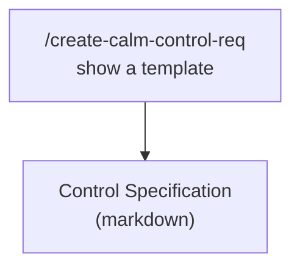
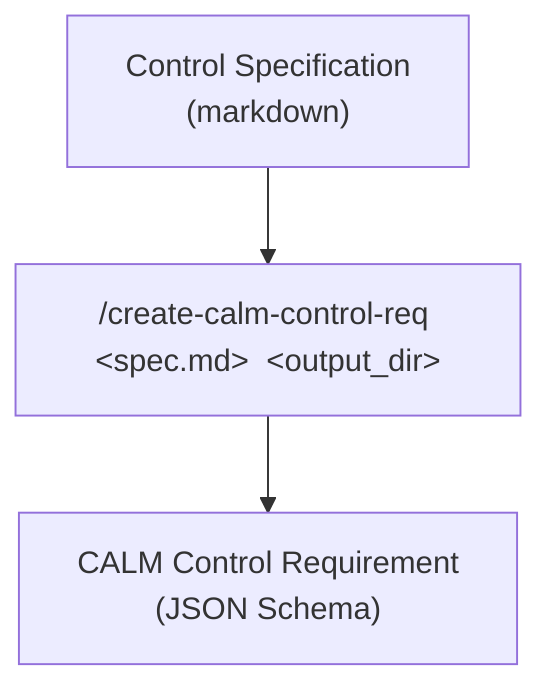

# Control Creation Example

This directory demonstrates the `create-calm-control-req` agent skill, which converts a markdown-based control specification into a CALM control requirement JSON file (a JSON Schema document).

## Contents

```
control-creation/
├── architecture/
│   ├── README.md                              # Working architecture example and validation notes
│   ├── sample-control-usage.architecture.json # Example CALM architecture using the generated requirement
│   └── url-mapping.json                       # Local URL mapping for the example requirement
├── control-spec/
│   └── control-spec-001.md          # Input: markdown control specification
└── generated-requirements/
    └── sample-control-requirement.json  # Output: generated CALM control requirement JSON
```

## The Skill

`create-calm-control-req` supports two modes:

- **Template Mode** — shows the markdown authoring template (`show template`) so you can draft a new spec.



- **Conversion Mode** — converts a filled-in markdown spec into CALM control requirement JSON, given a `spec_file` and an `output_dir`.



## Running the Skill

### Template Mode

To create a template for defining a control

```
/create-calm-control-req show a template
```

This will show a markdown template that the user can fill in the required information and save to disk.

```
# Control ID: [ENTER-CONTROL-ID]

## Name: [Enter Control Name]

## Description

[Enter a clear, concise description of what this control enforces. Describe the purpose, scope, and intended outcomes. This will be the main documentation of the control.]

---

## Properties

### [Property Name 1: camelCase or kebab-case]

- Type: numeric
- Description: [What does this property represent? What constraint does it enforce?]
- Value Type: integer
- Minimum: [optional number, e.g., 8]
- Maximum: [optional number, e.g., 128]

**Example**: For a password length requirement, you might have:
- Type: numeric
- Description: Minimum password length in characters
- Value Type: integer
- Minimum: 8
- Maximum: 128

---

### [Property Name 2: camelCase or kebab-case]

- Type: enum
- Description: [What are the allowed options? Why are these options valid?]
- Values: 
  - value-1
  - value-2
  - value-3
  - value-4

**Example**: For authentication methods, you might have:
- Type: enum
- Description: Approved authentication mechanisms
- Values:
  - mfa
  - oauth2
  - saml
  - ldap

---

### [Property Name 3: camelCase or kebab-case]

- Type: string
- Description: [What is the purpose of this string property? Are there any format constraints?]

**Example**: For a policy reference, you might have:
- Type: string
- Description: Reference to the security policy document URL or identifier

---

### [Property Name 4: camelCase or kebab-case]

- Type: boolean
- Description: [What true/false decision does this property capture?]

**Example**: For an MFA toggle, you might have:
- Type: boolean
- Description: Whether multi-factor authentication is mandatory

---

## Template Instructions

**Before converting to JSON, verify:**

- [ ] Control ID follows your naming convention (e.g., CTL-001)
- [ ] Name is concise and descriptive
- [ ] Description is complete and unambiguous
- [ ] All properties are listed with their types
- [ ] Numeric properties have value-type, and constraints where needed
- [ ] Enum properties list all valid values
- [ ] Boolean properties represent true/false behavior clearly
- [ ] Property names are consistent (kebab-case recommended)
- [ ] No typos or formatting issues

**Tips:**

- Use kebab-case for all property names (e.g., `min-password-length` not `minPasswordLength`)
- Be specific about constraints: don't use vague ranges
- For numeric properties, always specify if it's integer or float
- For enums, ensure values are meaningful and complete
- For boolean properties, describe what `true` and `false` mean in plain language
- Keep descriptions short but clear—one sentence is ideal, two is maximum
```


### Conversion Mode
Invoke the skill with the spec file and an output directory:

#### Expample Control Specification: [`control-spec/control-spec-001.md`](./control-spec/control-spec-001.md)

A markdown file describing a control named **Sample Control** (`CTRL-001`) with six properties covering each supported property type:

| Property | Type | Constraints |
|---|---|---|
| `time-out` | numeric (integer) | minimum: 1 |
| `latency-range` | numeric (float) | minimum: 0.5, maximum: 20.0 |
| `protection-level` | enum | low, medium, high |
| `information-level` | enum | not sensitive, sensitive, very sensitive |
| `control-string` | string | — |
| `control-flag` | boolean | — |

```
/create-calm-control-req examples/control-creation/control-spec/control-spec-001.md examples/control-creation/generated-requirements
```

The skill reads the markdown spec, parses each property definition, and generates a CALM Control Requirements JSON Schema document that:

- Composes with the CALM control-requirement meta-schema via `allOf`
- Represents `control-id`, `name`, and `description` as `const` values
- Maps numeric properties to `type: "integer"` or `type: "number"` with `minimum`/`maximum`
- Maps enum properties to `$ref`-linked definitions under `defs`
- Maps string and boolean properties directly

## Output: [`generated-requirements/sample-control-requirement.json`](./generated-requirements/sample-control-requirement.json)

The generated file, saved using a kebab-case name derived from the control's `Name` field (`Sample Control` → `sample-control-requirement.json`).

## Using the Generated Requirement

To use this requirement in an architecture, reference it from a `controls` block and supply a `config` that satisfies its constraints:

For a complete working example, see [`architecture/README.md`](./architecture/README.md).

```json
"controls": {
    "sample-control": {
        "description": "Applies the sample control to this component",
        "requirements": [
            {
                "requirement-url": "http://example.com/controls/requirements/sample-control-requirement.json",
                "config": {
                    "control-id": "CTRL-001",
                    "name": "Sample Control",
                    "description": "This demonstrates creating a CALM Control Requirement",
                    "time-out": 30,
                    "latency-range": 5.0,
                    "protection-level": "high",
                    "information-level": "sensitive",
                    "control-string": "example-value",
                    "control-flag": true
                }
            }
        ]
    }
}
```

Then validate the architecture with `calm validate -a <architecture-file>`, using `--url-to-local-file-mapping` if the requirement schema isn't published yet:

```bash
calm validate -a test-architecture.json -u url-mapping.json
```

Typical successful output includes a summary showing zero errors and zero warnings.
